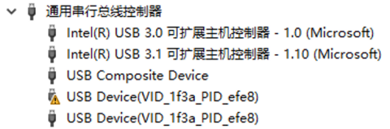
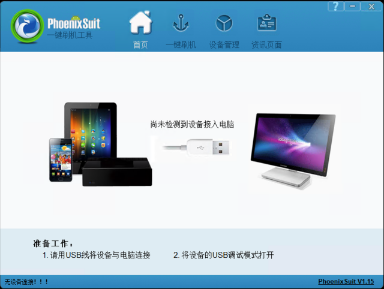
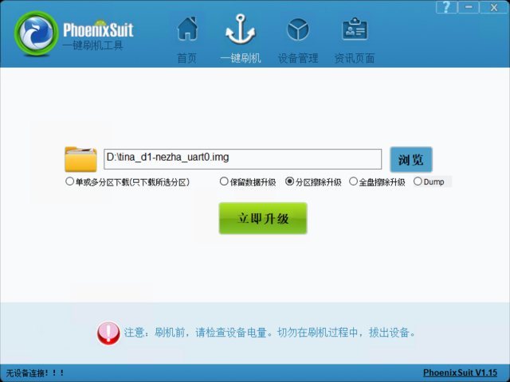
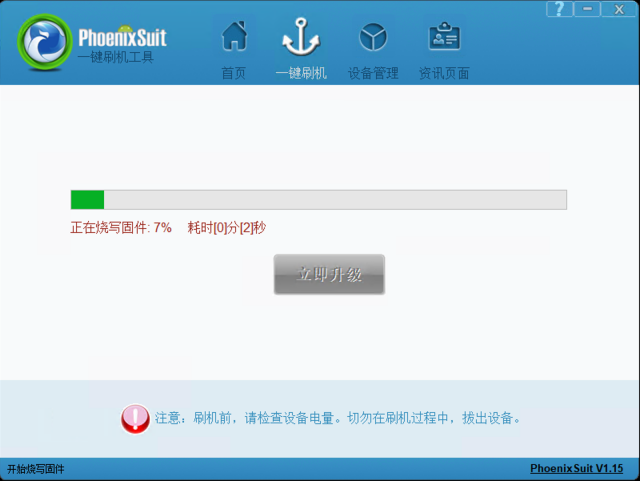
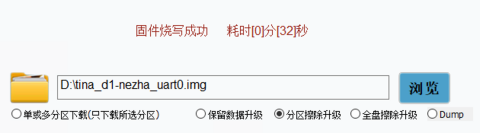

# Flash Image
This guide is an instruction about flashing image to D1 development board.

## Setup Environment

Using the Allwinner programming tools and drivers in windows or linux environment.

This guide introduces the flash process in windows pc，linux environment is similar with it.

### Install driver

- Download and install the USB driver for flashing image.
  
  [USB driver download](https://www.aw-ol.com/downloads/resources/15)
  
  > Need to login to download resources.
  
- Decompress `全志USB烧录驱动20201229.zip` , run install.bat to install the USB driver.

  

  > Holding the FEL button and power on, a USB Device (VID_1f3a_PID_efe8) device appears, indicating that the driver has been successfully installed.

### Install flash tool

- Download and install PhoenixSuit tool.
  
  [PhoenixSuit download](https://www.aw-ol.com/downloads/resources/13)
  
  > Need to login to download resources.
  
- Decompress `AllwinnertechPhoeniSuitRelease20201225.zip` , run PhoenixSuit to install.

  

- Using flash tool in linux PC
  
  [LiveSuit download](https://www.aw-ol.com/downloads/resources/19)

### Flashing image

1. Image file
   Compile and pack by yocto environment, image file is `tina_d1-nezha_uart0.img`

2. Disconnect the board from PC and power off. On the `一键刷机` page, select the image to be flashed, and select the flashing method

   

3. Press and hold the FEL button, connect the OTG tpye-c interface to the PC, release the FEL button 2~3 seconds after powering on, then it will start burning the image

   

   Flash image successfully:

   

4. Start linux system
   After successful flashing, it will automatically reboot into the linux system. It can be connected by the console serial port or adb.   
   The first time using adb, you need to install the adb tool.
   adb tool can be found at: https://developer.android.com/studio/releases/platform-tools (Official Site)。
